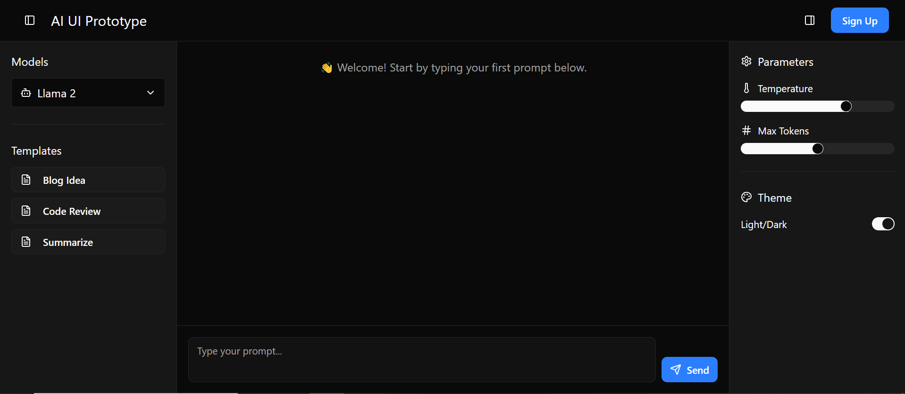
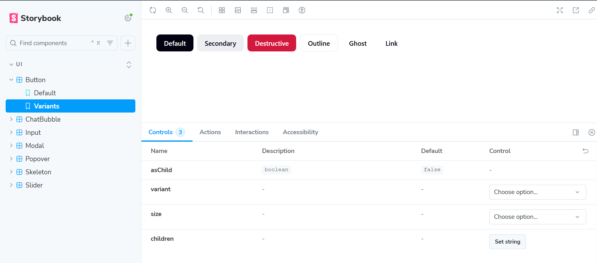

# React UI Assessment

## 1. 🔎 Research

### Platforms Reviewed

1. **OpenAI Playground**

   * Adjustable parameters (temperature, max tokens) with live feedback.
   * Clean two-panel layout separating input and controls.

2. **Hugging Face Spaces**

   * Lightweight hosting with flexible UI customization.
   * Model switching and community templates for reuse.

3. **Anthropic Claude UI**

   * Conversation-focused layout with message bubbles.
   * Minimal distractions, strong readability.

4. **Microsoft Copilot Lab**

   * Integrated prompt management (save/load).
   * User-friendly template system for reusability.

### Features Chosen (4–6)

* **Prompt Editor with Save/Load** (from Copilot Lab).
* **Chat Bubble Layout** (from Claude UI).
* **Model & Template Selection** (from Playground & Hugging Face).
* **Parameter Adjustments** (sliders for temperature & tokens, inspired by Playground).
* **Theme Toggle (Light/Dark)** (common across all platforms).

## 2. 🎨 Design

### a. Figma/XD Mockup

👉 [Figma/XD Mockup](https://www.figma.com/make/hm4qWBSwxsTnl8rRSH5cdz/Assessment-UI?node-id=0-7&t=fzztCkxMwQxUWS2U-1)

### b. Tailwind Token Mapping

| Design Element    | Tailwind Token / Variable                          | Example Usage            |
| ----------------- | -------------------------------------------------- | ------------------------ |
| Background        | `--background` → `bg-background`                   | App shell, chat area     |
| Foreground (Text) | `--foreground` → `text-foreground`                 | Chat text, headings      |
| Primary Button    | `--primary` → `bg-primary text-primary-foreground` | Send button              |
| Secondary Button  | `--secondary` → `bg-secondary`                     | Sidebar template buttons |
| Accent/Highlight  | `--accent` → `bg-accent`                           | Hover states, highlights |
| Border            | `--border` → `border-border`                       | Sidebars, dividers       |
| Muted Text        | `--muted-foreground` → `text-muted-foreground`     | Placeholder, hint text   |

### c. Translating Design → Code

* **Chat Bubbles** → `ChatBubble` component with `user` vs `ai` roles.
* **Prompt Editor** → Single fixed-bottom textarea + send button, with popover for saved templates.
* **Sidebars** → LeftSidebar for models/templates, RightSidebar for parameters & theme toggle.
* **Sliders & Switches** → Radix primitives styled with Tailwind tokens.
* **Theme Toggle** → Dark/light persisted in `localStorage`.

---

## 3. ⚙️ Development

### Implementation Notes

* **ChatArea**

  * Scrollable message area implemented with `ScrollArea`.
  * Shows welcome message when no chat exists.
  * AI messages support `Copy` + `Download JSON`.

* **Prompt Editor**

  * Inline `Textarea` + Send button.
  * Suggests saved prompts in Popover as user types.
  * Loads dummy templates from `/src/data/templates.json`.

* **Sidebars**

  * **LeftSidebar** → Model dropdown (from `/src/data/models.json`), template shortcuts.
  * **RightSidebar** → Parameters (temperature, max tokens sliders) + theme toggle.

* **Mock Data**

  * Data stored in `/src/data/`.
  * `setTimeout` used to simulate latency instead of API calls.

* **Storybook**

  * Stories live in `/src/stories/`.
  * Components with stories: `Button`, `Input`, `Slider`, `Popover`, `ChatBubble`, `Skeleton`, etc.

### Known Limitations

* **Chat Scroll**: Input area may temporarily move out of view on overflow; needs refinement.
* **Mock API**: No real API, only simulated JSON with `setTimeout`.
* **Storybook Folder**: Stories live in `/src/stories/` instead of `.storybook/`.

---

## 📂 Project Structure

```
src/
 ├── components/      
 │    ├── ui/         
 │    ├── ChatArea.tsx
 │    ├── LeftSidebar.tsx
 │    ├── RightSidebar.tsx
 │    └── Header.tsx
 ├── data/            
 ├── stories/         
 ├── styles/          
 └── App.tsx
```

---

## 📸 Screenshots

* **Main UI (final)**: 

* **Storybook Components**:
 

---

## 🚀 Hosted Demo

👉 [Live Assessment UI on Vercel](https://vercel.com/uk2459644s-projects/assessment-ui-predusk)

## 🚀 How to Run

```bash
# Install dependencies
npm install

# Start dev server
npm run dev

# Run Storybook
npm run storybook

# Build production
npm run build
```

---
